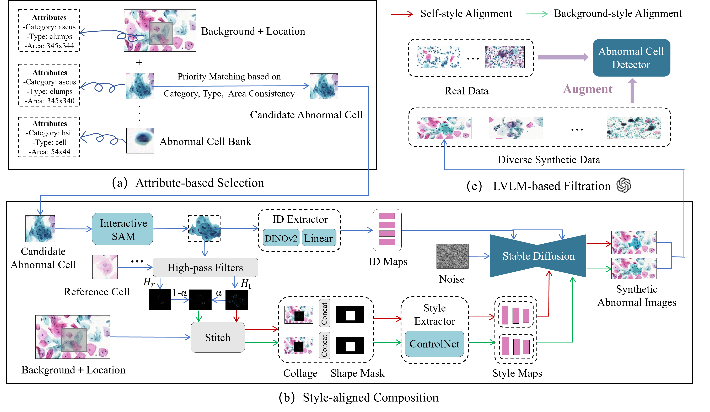

<p align="center">

  <h2 align="center">Style-Aligned Image Composition for Robust Detection of Abnormal Cells in Cytopathology</h2>
  
  <table align="center">
    <tr>
    <td>
      
    </td>
    </tr>
  </table>


## Installation
Install with `conda`: 
```bash
conda env create -f environment.yaml
conda activate anydoor
```
or `pip`:
```bash
pip install -r requirements.txt
```
Additionally, for training, you need to install panopticapi, pycocotools, and lvis-api.
```bash
pip install git+https://github.com/cocodataset/panopticapi.git

pip install pycocotools -i https://pypi.douban.com/simple

pip install lvis
```
## Download Checkpoints
Download AnyDoor checkpoint: 
* [ModelScope](https://modelscope.cn/models/damo/AnyDoor/files)
* [HuggingFace](https://huggingface.co/spaces/xichenhku/AnyDoor/tree/main)

**Note:** We include all the optimizer params for Adam, so the checkpoint is big. You could only keep the "state_dict" to make it much smaller.


Download DINOv2 checkpoint and revise `/configs/anydoor.yaml` for the path (line 83)
* URL: https://github.com/facebookresearch/dinov2?tab=readme-ov-file

Download Stable Diffusion V2.1 if you want to train from scratch.
* URL: https://huggingface.co/stabilityai/stable-diffusion-2-1/tree/main


## Inference
We provide inference code in `run_inference.py` (from Line 222 - ) for both inference single image and inference a dataset (VITON-HD Test). You should modify the data path and run the following code. The generated results are provided in `examples/TestDreamBooth/GEN` for single image, and `VITONGEN` for VITON-HD Test.

```bash
python run_inference.py
```
The inferenced results on VITON-Test would be like [garment, ground truth, generation].

*Noticing that AnyDoor does not contain any specific design/tuning for tryon, we think it would be helpful to add skeleton infos or warped garment, and tune on tryon data to make it better :)*
  <table align="center">
    <tr>
    <td>
      
    </td>
    </tr>
  </table>


Our evaluation data for DreamBooth an COCOEE coud be downloaded at Google Drive:
* URL: [to be released]


## Acknowledgements
This project is developped on the codebase of [ControlNet](https://github.com/lllyasviel/ControlNet). We  appreciate this great work! 
